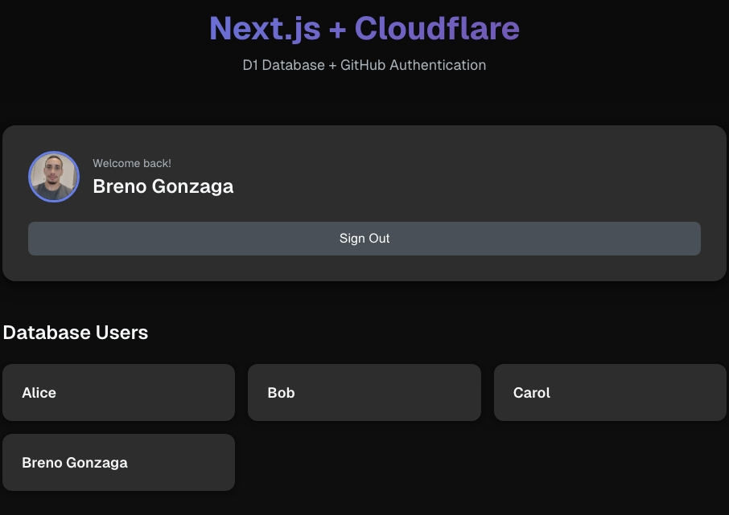

# Next.js + Cloudflare + Prisma + D1

Next.js template configured for deployment on Cloudflare Workers with Prisma and D1 Database.



## 🚀 Stack

- **Next.js 15.5.9** - React Framework
- **Cloudflare Workers** - Serverless deployment platform
- **Cloudflare D1** - Serverless SQLite database
- **Prisma 7.2.0** - ORM with driver adapter for D1
- **NextAuth.js 5.0** - Authentication with GitHub OAuth
- **OpenNext Cloudflare** - Adapter for Cloudflare Workers

## 📋 Prerequisites

- Node.js 18+ installed
- Cloudflare account with D1 access
- GitHub OAuth App (for authentication)
- Wrangler CLI (included in dependencies)

## 🛠️ Initial Setup

### 1. Install Dependencies

```bash
npm install
```

### 2. Authenticate with Cloudflare

```bash
npx wrangler login
```

### 3. Create D1 Database (if it doesn't exist)

```bash
npx wrangler d1 create next-template
```

Copy the returned `database_id` and update it in [wrangler.jsonc](wrangler.jsonc):

```jsonc
{
  "d1_databases": [
    {
      "binding": "DB",
      "database_name": "next-template",
      "database_id": "YOUR_DATABASE_ID_HERE"
    }
  ]
}
```

### 4. Configure Environment Variables

Create `.env.local` file:

```env
# NextAuth
AUTH_SECRET="development-secret-change-in-production"
AUTH_TRUST_HOST=true
NEXTAUTH_URL="http://localhost:8787"

# GitHub OAuth
AUTH_GITHUB_ID="your_github_client_id"
AUTH_GITHUB_SECRET="your_github_client_secret"
```

### 5. Generate Prisma Client

```bash
npx prisma generate
```

### 6. Initialize Database

```bash
# Local
npm run init:db

# Production (add --remote flag)
npx wrangler d1 execute next-template --file=populate.sql --remote
```

## 🏃 Available Commands

### Development

```bash
# Standard Next.js development
npm run dev

# Build Next.js project
npm run build

# Local preview with Wrangler (Cloudflare Workers)
npm run preview
```

### Cloudflare Workers

```bash
# Generate Prisma Client
npm run prepare:db

# Build for Cloudflare Workers
npm run build:worker

# Local preview
npm run preview:worker

# Deploy to Cloudflare
npx wrangler deploy
```

### Database

```bash
# Initialize database (create tables)
npm run init:db

# Open Prisma Studio
npx prisma studio

# Execute SQL on local D1
npx wrangler d1 execute next-template --command="SELECT * FROM User"

# Execute SQL on remote D1
npx wrangler d1 execute next-template --command="SELECT * FROM User" --remote
```

## 📁 Project Structure

```
next-template/
├── app/                    # Next.js routes and pages
│   ├── api/auth/          # NextAuth API routes
│   ├── layout.tsx         # Root layout
│   └── page.tsx           # Home page
├── lib/
│   └── db.ts              # Prisma + D1 configuration
├── schema.prisma          # Database schema
├── populate.sql           # Initial SQL seed
├── auth.ts                # NextAuth configuration
├── wrangler.jsonc         # Cloudflare configuration
├── open-next.config.ts    # OpenNext configuration
└── package.json
```

## ⚙️ Important Configurations

### Prisma with D1

The [lib/db.ts](lib/db.ts) file uses Prisma's driver adapter for D1:

```typescript
import { PrismaClient } from "@prisma/client";
import { PrismaD1 } from "@prisma/adapter-d1";
import { getCloudflareContext } from "@opennextjs/cloudflare";

export const getDb = async () => {
  const { env } = await getCloudflareContext({ async: true });
  const adapter = new PrismaD1(env.DB);
  return new PrismaClient({ adapter });
};
```

### NextAuth

Configured in [auth.ts](auth.ts) with:

- Prisma Adapter for data persistence
- GitHub OAuth provider
- D1 support via async context
- Trust host enabled for development

## 🌐 Deployment

### Deploy to Cloudflare

```bash
# Build and deploy
npm run build:worker
npx wrangler deploy
```

### Environment Variables

Configure in Cloudflare Dashboard or via Wrangler:

```bash
# Add secrets
npx wrangler secret put AUTH_SECRET
npx wrangler secret put AUTH_GITHUB_ID
npx wrangler secret put AUTH_GITHUB_SECRET
npx wrangler secret put NEXTAUTH_URL
npx wrangler secret put AUTH_TRUST_HOST
```

### Production Environment Variables

When deploying to production, set:

```env
AUTH_SECRET="your-production-secret"
AUTH_GITHUB_ID="your_github_client_id"
AUTH_GITHUB_SECRET="your_github_client_secret"
NEXTAUTH_URL="https://your-domain.workers.dev"
AUTH_TRUST_HOST="true"
```

## 🔐 GitHub OAuth Setup

1. Go to [GitHub Developer Settings](https://github.com/settings/developers)
2. Create a new OAuth App or use existing one
3. Configure:
   - **Application name:** Your app name
   - **Homepage URL:** `https://your-domain.workers.dev`
   - **Authorization callback URL:** `https://your-domain.workers.dev/api/auth/callback/github`
4. Copy the Client ID and generate a Client Secret
5. Add them to your environment variables

## 📝 Important Notes

- **Next.js 15.5.9**: Supported version by OpenNext Cloudflare
- **Next.js 16**: Not fully supported by the adapter yet
- **Local D1**: Data is stored in `.wrangler/state/v3/d1`
- **Prisma 7**: New syntax without `url` in datasource

## 🔗 Useful Links

- [Cloudflare D1 Docs](https://developers.cloudflare.com/d1/)
- [Prisma D1 Adapter](https://www.prisma.io/docs/orm/overview/databases/cloudflare-d1)
- [OpenNext Cloudflare](https://opennext.js.org/cloudflare)
- [NextAuth.js](https://authjs.dev/)
- [Cloudflare Workers](https://developers.cloudflare.com/workers/)

## 📄 License

MIT
